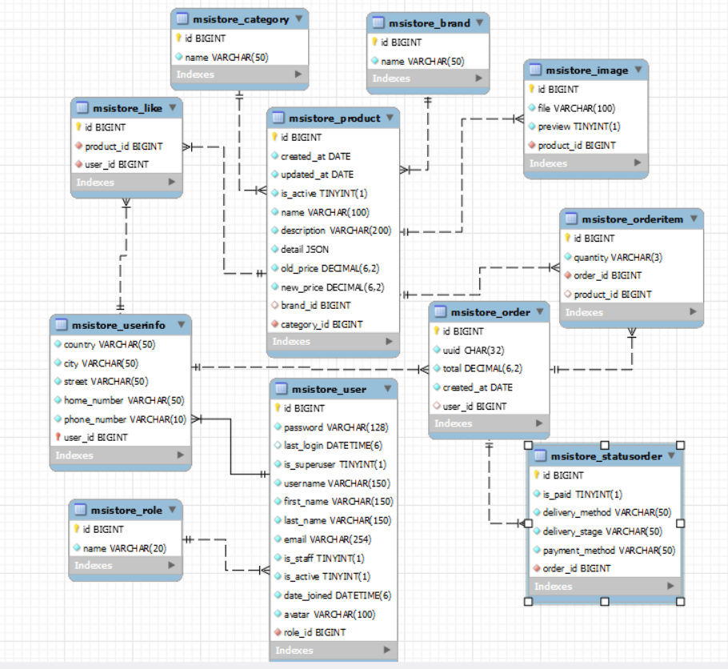
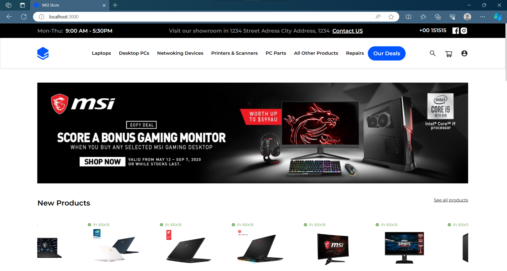
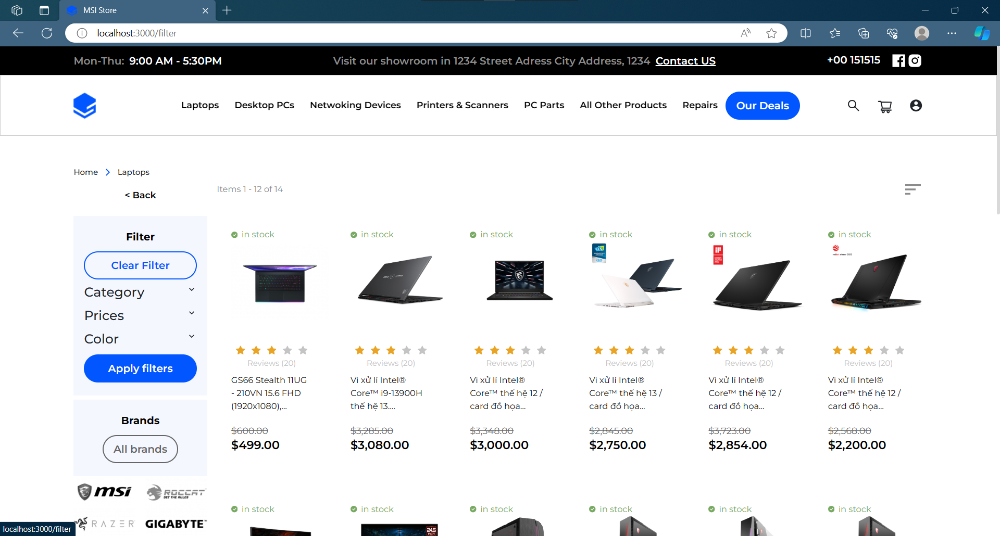
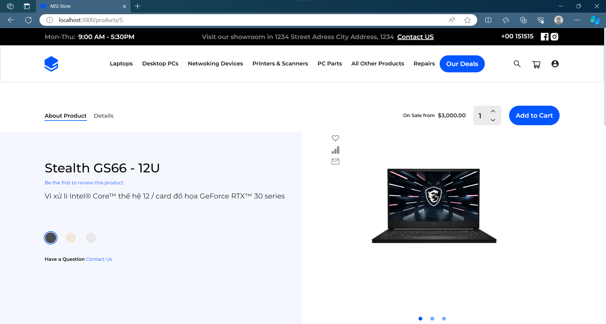
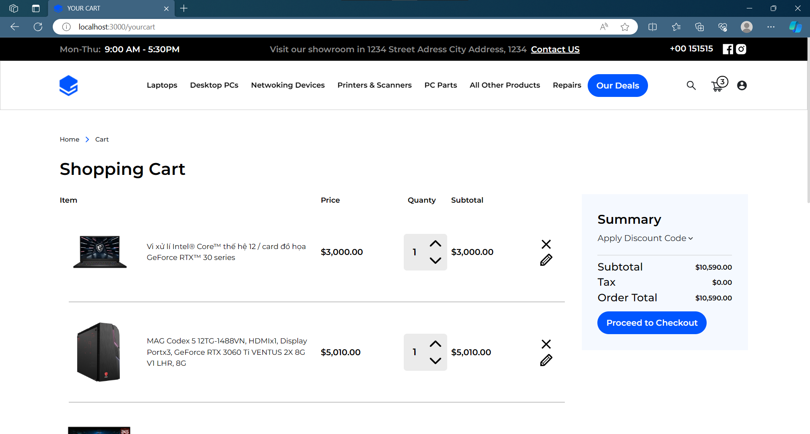
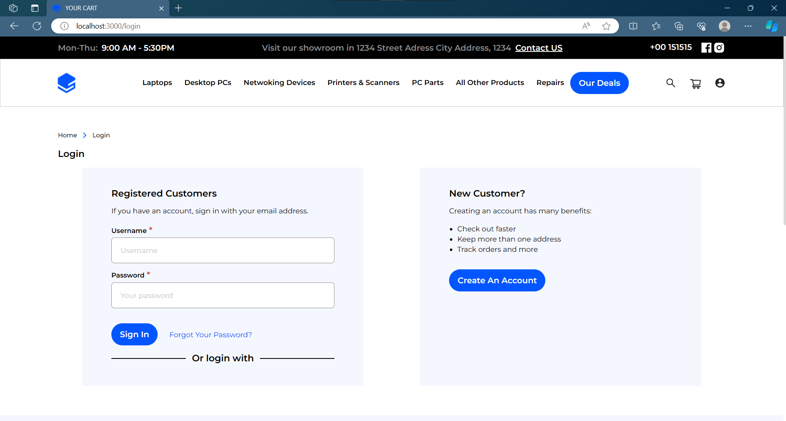
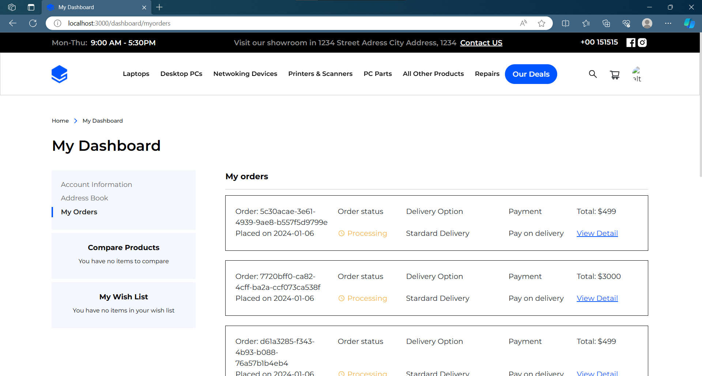

# Msistore Ecommerce website
## Description: 
This project is a clone of the [MSI official website](https://vn.msi.com/) based on the design provided in Figma. It is created solely for educational purposes and should not be used for any commercial activities, including but not limited to selling products, engaging in business transactions, or misleading users. The intention behind this project is to enhance learning and practice web development skills.

Note: It is essential to respect intellectual property rights, and this project should be used responsibly and ethically.


## Work Under Progress

**Version 1**
* The data is stored locally and must be re-new periodically 
* Backend has not been added. 
* APIs are faked by [JSon Server](https://github.com/typicode/json-server) (a libary typically create simple CRUD api using mostly json data)
* Version 1 is hosted [HERE!](https://msi-store.vercel.app/)
* Fake Apis is hosted [HERE!](https://json-server-sand.vercel.app/api/data)

**Version 2 (recommend)**
* Fixed bugs from predecessor, add some pages, updated ui... 
* Backend django has been added [learn more](https://github.com/Theanhmgt/msistore-django)
* Data is stored in Mysql database
* Version 2 is hosted [HERE!](https://msistore.vercel.app/) and still updated daily
## Features

- DeskTop/Tablet/Mobile Responsiveness
- Search Functionality
- Product Pages
- Shopping Cart
- User Accounts
- Loading Speed Optimization
## Tech Stack

**Client:** ReactJs, Redux,Redux-Thunk, Bootstrap,Css, Scss

**Server:** Apache, Django

**Database:** Mysql
## Orther Resource

- Ui design: [Figma](https://www.figma.com/file/t7fsZHL3x8bu4KxpKW84J4/Tech-Online-Store-Design?type=design&node-id=133-3117&mode=design)
- Product Info(image,name,prices, ,etc): [MSI official website](https://vn.msi.com/)


## Database Schema




## Screenshots

Home page Screenshot:


---
Product Preview:


---
Product Detail:


---
User cart:


---
Sign-in Page:


---
User-dashboard Page:




## Demo

Version 1: [Click here!](https://msistore.vercel.app/)

Version 2: [Click here!](https://msi-store.vercel.app/)


## Prerequisites
The following software is required to be installed on your system:

* node: 21.x
* npm: 10.x

Type the following commands in the terminal to verify your node and npm versions
```bash
  node -v
  npm -v
```
## Run Locally

Clone the project

```bash
  git clone https://github.com/Theanhmgt/msistore-react.git
```

Go to the project directory

```bash
  cd misstore-react
```

Install dependencies

```bash
  npm -i install
```

Start the server

```bash
  npm run start
```


## Developed With

* [Visual Studio Code](https://code.visualstudio.com/) - A source code editor developed by Microsoft for Windows, Linux and macOS. It includes support for debugging, embedded Git control, syntax highlighting, intelligent code completion, snippets, and code refactoring
* [React](https://reactjs.org/) - A javascript library for building user interfaces
* [Create react app](https://create-react-app.dev/) - A quick method to start developing a react application.
* [Babel](https://babeljs.io/) - A transpiler for javascript
* [Webpack](https://webpack.js.org/) - A module bundler
* [SCSS](http://sass-lang.com/) - A css metalanguage
## Authors

 [@Nguyễn Thế Anh](https://github.com/Theanhmgt)


## License

This project is licensed under the [MIT](https://choosealicense.com/licenses/mit/)


## Support

For support, email theanhnguyen.work@gmail.com

