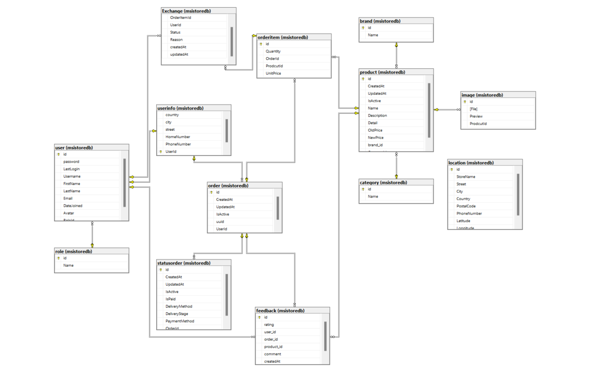

<p align="center">
  <a href="https://skillicons.dev">
    
  </a>
</p>

# Introduce

Our e-commerce platform offers a comprehensive shopping experience, allowing customers to purchase computers and accessories from various brands. The key functionalities include user registration and login, adding items to the cart, checking out, and viewing order history.

## Table of Contents

- [Model Database](#model-database)
- [Features](#features)
  - [User Registration and Login](#user-registration-and-login)
  - [Product Browsing and Search](#product-browsing-and-search)
  - [Product Details](#product-details)
  - [Shopping Cart](#shopping-cart)
  - [Checkout Process](#checkout-process)
  - [Order History](#order-history)
- [Admin Site](#admin-site)
  - [Overview](#overview)
  - [User Management](#user-management)
  - [Product Management](#product-management)
  - [Order Management](#order-management)
  - [Analytics and Reports](#analytics-and-reports)
- [How Install](#how-install)
- [Contact](#contact)

## Model Database


[Back to Top](#table-of-contents)

## Features

### User Registration and Login:

- **Registration:** New users can create an account by providing their personal details such as name, email, and password.
- **Login:** Existing users can log in using their email and password.
  [Back to Top](#table-of-contents)

### Product Browsing and Search:

- **Product Categories:** Users can browse through different categories of computers and accessories.
- **Search Functionality:** Users can search for specific products by entering keywords.
  [Back to Top](#table-of-contents)

### Product Details:

- **Detailed Descriptions:** Each product page includes detailed descriptions, specifications, and images.
- **Reviews and Ratings:** Users can read reviews and ratings left by other customers.
  [Back to Top](#table-of-contents)

### Shopping Cart:

- **Add to Cart:** Users can add products to their shopping cart.
- **Cart Management:** Users can view and manage the items in their cart, update quantities, or remove items.
  [Back to Top](#table-of-contents)

### Checkout Process:

- **Billing Information:** Users enter their billing information.
- **Shipping Information:** Users provide their shipping address.
- **Payment Methods:** Multiple payment options are available (e.g., credit card, PayPal).
- **Order Confirmation:** Users receive an order confirmation after successful payment.
  [Back to Top](#table-of-contents)

### Order History:

- **View Orders:** Users can view their past orders and check the status of current orders.
  [Back to Top](#table-of-contents)

## Admin Site

### Overview

A comprehensive overview of the store's performance, including sales data, recent orders, and user activity.
[Back to Top](#table-of-contents)

### User Management:

- **View Users:** Administrators can view a list of all registered users.
- **Manage Users:** Administrators can add, edit, or delete user accounts, and reset passwords if necessary.
  [Back to Top](#table-of-contents)

### Product Management:

- **Add Products:** Administrators can add new products, including details such as name, description, price, and images.
- **Edit Products:** Administrators can update product information.
- **Delete Products:** Administrators can remove products from the catalog.
  [Back to Top](#table-of-contents)

### Order Management:


- **View Orders:** Administrators can view all orders placed by customers.
- **Update Order Status:** Administrators can update the status of orders (e.g., processing, shipped, delivered).
- **Manage Returns:** Administrators can handle return requests and process refunds.
  [Back to Top](#table-of-contents)

### Analytics and Reports:


- **Sales Reports:** Generate reports on sales performance over different periods.
- **User Activity:** Monitor user activity and engagement on the platform.
- **Inventory Reports:** Keep track of inventory levels and receive alerts for low stock items.
  
  [Back to Top](#table-of-contents)

## How Install

Front-end app

```bash
git clone https://github.com/MinhTamNT/msistore-react
```

```
npm install
```

Back-end App

```bash
  git clone https://github.com/MinhTamNT/msistore-aspmvc.git
```

```
Build Project
```

- In file appsettings.Development.json configuration all key here

```bash
{
  "Logging": {
    "LogLevel": {
      "Default": "Information",
      "Microsoft.AspNetCore": "Warning"
    }
  },
  "Jwt": {
    "Key": "",
    "Issuer": "",
    "Audience": ""
  },
  "Cloudinary": {
    "CloudName": "",
    "ApiKey": "",
    "ApiSecret": ""
  }


}

```

- Cloudinary : https://cloudinary.com/documentation
- JWT : You can generate key on the webiste such as : https://www.uuidgenerator.net/

- File MapController you must enter the key like that :

```c#
 private readonly string _bingMapsApiKey = "";
```

- Getting key bing map : https://learn.microsoft.com/en-us/bingmaps/getting-started/bing-maps-dev-center-help/getting-a-bing-maps-key

```bash
Run Project : Press F5
```

## Contact

- **GitHub:** [Minh Tam](https://github.com/MinhTamNT)
- **GitHub:** [The Anh](https://github.com/Theanhmgt)
- **GitHub:** [Sinh Hung](https://github.com/ngsinhhung)
- **Address:** OPEN UNIVERSITY , VIETNAM

[Back to Top](#table-of-contents)
